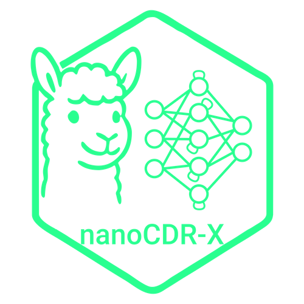

# nanocdr-x 



## Predict and explain CDR regions in nanobody sequences

A lightweight CLI package for predicting complementarity-determining regions (CDRs) in nanobody sequences and extracting model interpretability data (hidden states and saliency maps) from a trained TensorFlow LSTM model.

---

## Features

- **predict_cdrs**: Predicts CDR1, CDR2, and CDR3 regions from input sequences.
- **explain_hidden_states**: Extracts per-token hidden-state vectors from the second BiLSTM layer.
- **explain_saliency**: Computes gradient-based saliency maps for model predictions, outputting detailed time- and position-wise importances.

---

## Installation

Install directly from the `lescailab` channel on Anaconda:

```bash
conda install -c lescailab nanocdr-x
```
## CLI Usage

All commands accept a required input CSV (`-i/--input`) with at least two columns:

- `identifier`: unique sequence ID
- `input`: amino-acid sequence string (max length 150)

### 1. predict_cdrs

Predicts CDR regions and outputs a CSV with columns `identifier`, `input`, `predicted_cdr1`, `predicted_cdr2`, `predicted_cdr3`.

```bash
predict_cdrs \
  -i path/to/input.csv \
  -o path/to/output_cdrs.csv \
  --model /path/to/saved_model \
  --char_mapping /path/to/char_mapping.csv
```

### 2. explain_hidden_states

Extracts hidden-state vectors for each non-padded token. Outputs a CSV with columns:

- `sequence_id`, `position`, `token`, `pred_class`, and one column per hidden dimension (`hs_dim_0`, `hs_dim_1`, ...).

```bash
explain_hidden_states \
  -i path/to/input.csv \
  -o path/to/output_hidden_states.csv
```

### 3. explain_saliency

Computes gradient-based saliency maps, recording both time point and input position. Outputs a CSV with columns:

- `sequence_id`, `time_point`, `position`, `predicted_class`, `saliency`

```bash
explain_saliency \
  -i path/to/input.csv \
  -o path/to/output_saliency.csv
```

---

## Example

An example input file is bundled under `predict_nanobody_cdrs/example_data/example_input.csv`.

```bash
predict_cdrs -i predict_nanobody_cdrs/example_data/example_input.csv -o example_cdrs.csv
```

---

## Development & Testing

- Add or update example data under `predict_nanobody_cdrs/example_data/`.
- Ensure `MANIFEST.in` includes the example CSV.
- Build and run `conda build . --test` to verify all CLI commands succeed on the bundled example.

---

## Contributing

Contributions welcome! Please open issues or pull requests on the GitHub repository: <https://github.com/YourOrg/nanocdr-x>

---

## License

This project is licensed under the MIT License. See [LICENSE](LICENSE) for details.

